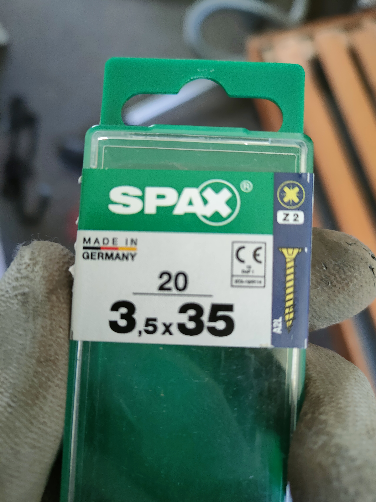
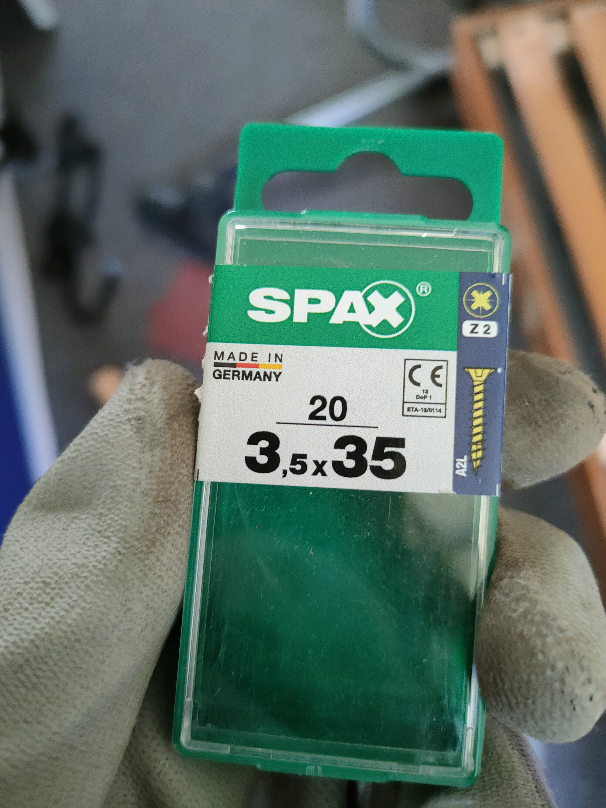
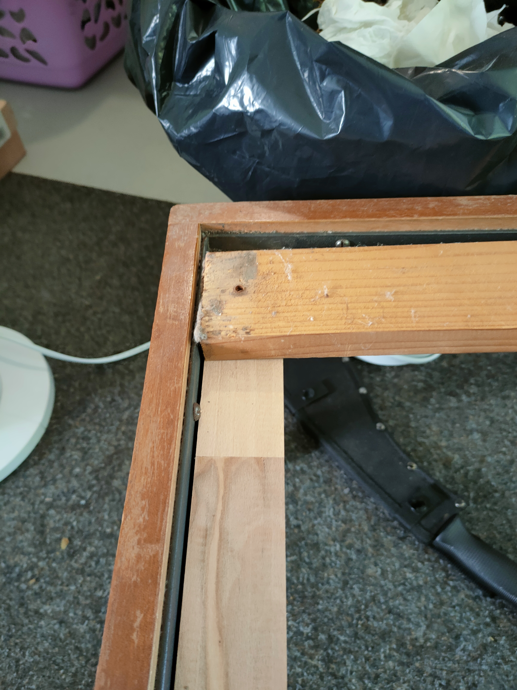
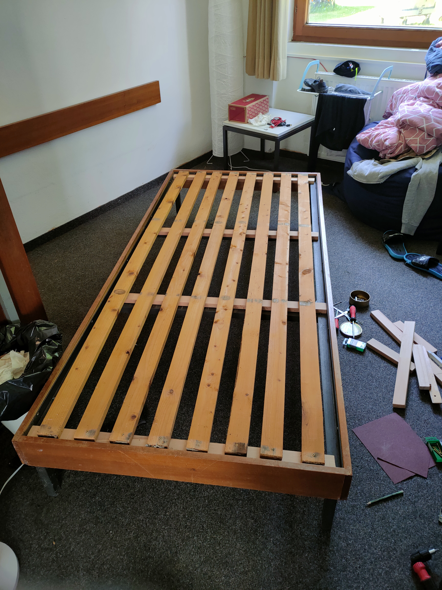
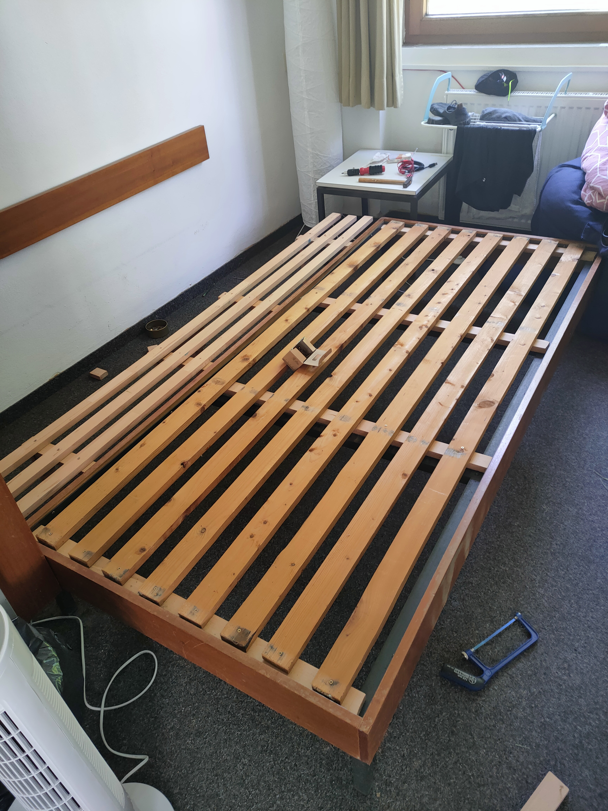
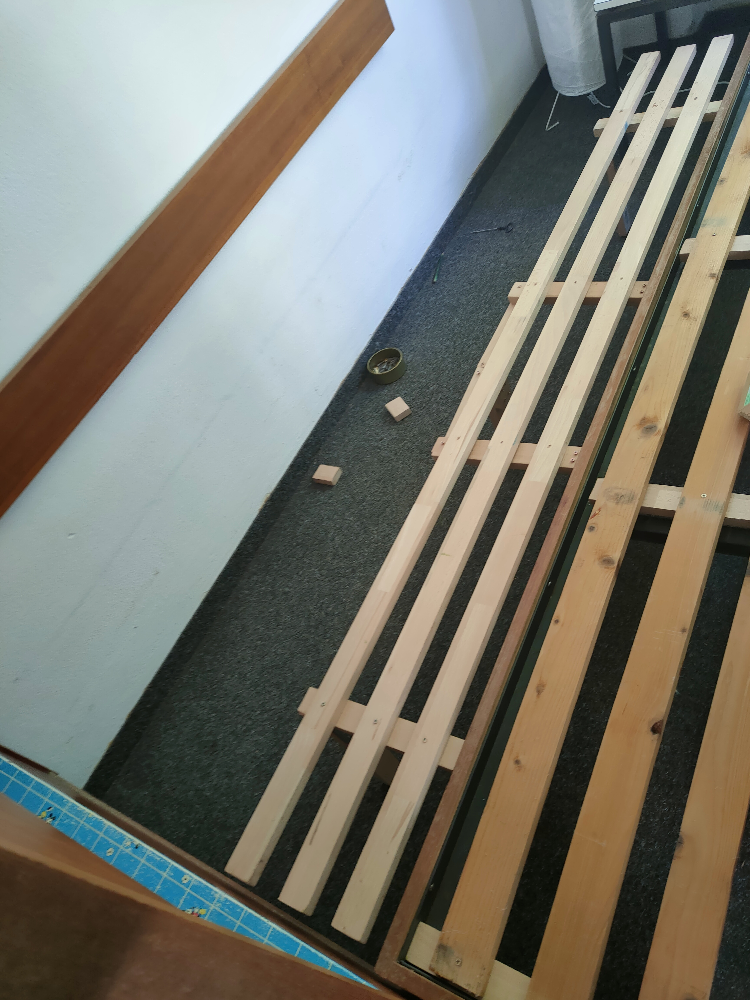

# Stustadt_Bed_Extension
See Guide.pdf

## Preface
Welcome to my tutorial on extending a single bed into a double bed. Before diving into the project, I encourage you to embrace a mindset of practicality and adaptation. While this guide offers step-by-step instructions, remember that your unique circumstances might require a few tweaks. Tailor this guide to your needs and preferences, ensuring the end result perfectly fits your living space.
Keep in mind: use common sense in every step. Measurements and Design might vary for your unique circumstances. 

Don't forget the golden rule of DIY: Measure twice, cut once. Use a pencil to mark your measurements and placements on the wood. This practice minimises errors and helps ensure a smoother process. It will result in a drastically better outcome, but even more importantly it will save time and money.

This project should cost around 40 euros in total, the biggest cost factor being the wood. It should take at most one working day, depening on your experience. If you have put together IKEA furniture and know how to safely saw some wood - you should be capable enough to extend your bed. I went to [Bauhaus](https://goo.gl/maps/CTeyRUpV2n5ZR5Df6) for the Materials and transported it back on my bike. That did not pose any challenges for me. If you are not confident enough to use your bike you can also rent a miles van. 

As part of the process, you'll need a mattress that fits your newly extended bed. I recommend Kleinanzeigen.de. You should be able to find a mattress for free there. You can store your old mattress in your floor's storage room, or throw it out if you plan to leave the larger mattress for the next tenant.

I hope you find this guide helpfull in your endeavour to avoid numb limbs when waking up in the morning.

Alexander Wachowiak

## Materials
- Wood Panels (e.g. 4x2cm)
    - 2m *3 (Length of Bed)
    - 0.9m *4 (Width of Bed Before Extension)
    - 0.28m *4 (“Extension Width”) <- “Extension Width” = (0.3m | 0.5m) - 0.02m
    - 0.27m *4 (“Extension Height”) <- “Extension Height” = “Total Bed Height” - “Panel Thickness”
- Corner Braces *4 <- Size scaled accordingly to Wood Panels
- Screws for Wood <- Size scaled accordingly to Wood Panels; e.g.
    - 3.5x25mm *>50 (Buy the large pack)
    - 3.5x35mm *>50 (Buy the large pack)

## Tools
- Screwdriver
- Power Screwdriver (Highly Recommended)
- Saw
- Sandpaper
- Ruler/Tape Measure
- Pencil
- Brain/Common Sense
- …

## Pre-Assembly
Assemble four of these Stands. Use the “Extension-Width”-Size Wood, the “Extension Height”-Size Wood and the corner Braces.

## Elevating the Bed Slats
The Level of the Bed Slats needs to be raised to match the height of the Extension. W/o this there would be a very uncomfortable bump in the mattress
- Remove old Wood Panels
- Put the new Panels where the old ones touched the Frame
- Fasten them with the larger Screws to the Bed Frame
- Put Old Panels Back and screw them in place

## Attaching the Stands
Attach the stands from the Pre-Assembly step to the frame of the bed. Make sure they are stable and properly attached. They should be able to hold your weight after attaching. Use the smaller screws here. The outer stands should be each at about 25% of the bed length (looking from each end), the inner stand evenly distributed between the outer ones. My pictures here use a slightly different set up.

## Installing the Extension Sled Base
Distribute the new Panels evenly on the extension Stands. Screw them in Place.
Final Step - Adding a Mattress

## Final Step - Adding a Mattress
Find a fitting Mattress e.g. on Kleinanzeigen.de

