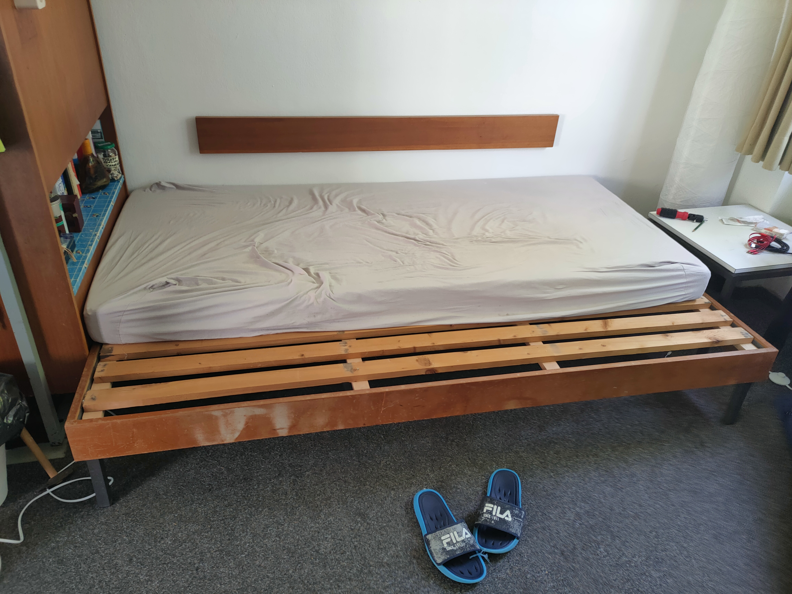

# Stustadt_Bed_Extension
See Guide.pdf

## Preface
Welcome to our tutorial on extending a single bed into a double bed. Before diving into the project, I encourage you to embrace a mindset of practicality and adaptation. While this guide offers step-by-step instructions, remember that your unique circumstances might require a few tweaks. Tailor this guide to your needs and preferences, ensuring the end result perfectly fits your living space.
This project should cost you around 40 euros—a small investment for the upgrade in comfort and space that a double bed provides. However, it's not just about saving money; it's also about putting in high-quality work. By dedicating ample time to this project, paying attention to detail, and striving for the best results, your efforts will undoubtedly pay off.
Always remember the golden rule of any DIY project: Measure twice, cut once. Precise measurements are crucial to the success of your bed extension. To ensure accuracy, mark your placements with a pencil before making any modifications. This practice minimises errors and helps ensure a smoother process.
As part of the process, you'll need a mattress that fits your newly extended bed. I recommend finding great deals on Kleinanzeigen.de, a platform for classified ads where you can find a wide range of options to suit your needs.
Keep in mind: use common sense in every step. Measurements and Design might vary for your unique circumstances. 
We hope you find this guide helpful, and we're excited to be part of your DIY journey. Enjoy the process, and here's to a more spacious and comfortable rest in your future double bed!

## Materials
- Wood Panels (e.g. 4x2cm)
    - 2m *3 (Length of Bed)
    - 0.9m *4 (Width of Bed Before Extension)
    - 0.28m *4 (“Extension Width”) <- “Extension Width” = (0.3m | 0.5m) - 0.02m
    - 0.27m *4 (“Extension Height”) <- “Extension Height” = “Total Bed Height” - “Panel Thickness”
- Corner Braces *4 <- Size scaled accordingly to Wood Panels
- Screws for Wood <- Size scaled accordingly to Wood Panels; e.g.
    - 3.5x25mm *>50 (Buy the large pack)
    - 3.5x35mm *>50 (Buy the large pack)

## Tools
- Screwdriver
- Power Screwdriver (Highly Recommended)
- Saw
- Sandpaper
- Ruler/Tape Measure
- Pencil
- Brain/Common Sense
- …

## Pre-Assembly
Assemble four of these Stands. Use the “Extension-Width”-Size Wood, the “Extension Height”-Size Wood and the corner Braces.

## Elevating the Bed Slats
The Level of the Bed Slats needs to be raised to match the height of the Extension. W/o this there would be a very uncomfortable bump in the mattress
- Remove old Wood Panels
- Put the new Panels where the old ones touched the Frame
- Fasten them with the larger Screws to the Bed Frame
- Put Old Panels Back and screw them in place

## Attaching the Stands
Attach the stands from the Pre-Assembly step to the frame of the bed. Make sure they are stable and properly attached. They should be able to hold your weight after attaching. Use the smaller screws here. The outer stands should be each at about 25% of the bed length (looking from each end), the inner stand evenly distributed between the outer ones. My pictures here use a slightly different set up.

## Installing the Extension Sled Base
Distribute the new Panels evenly on the extension Stands. Screw them in Place.
Final Step - Adding a Mattress

## Final Step - Adding a Mattress
Find a fitting Mattress e.g. on Kleinanzeigen.de

